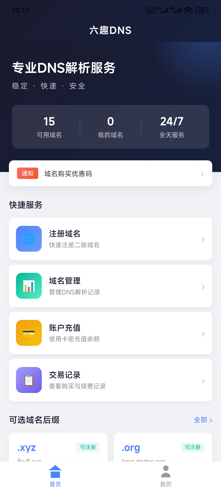
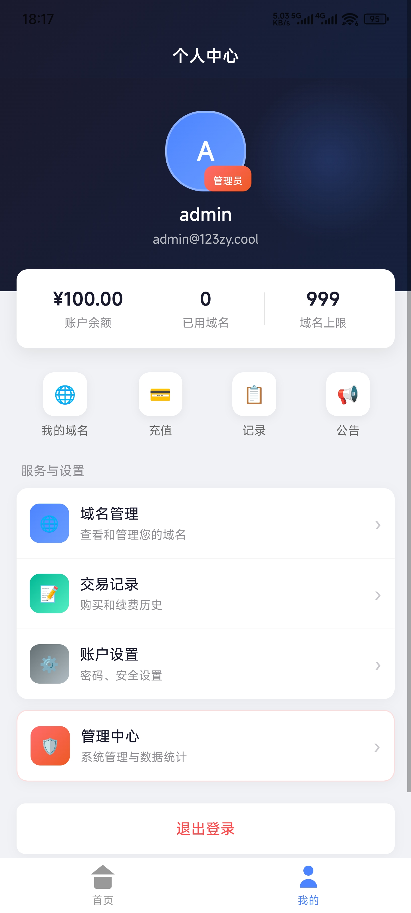
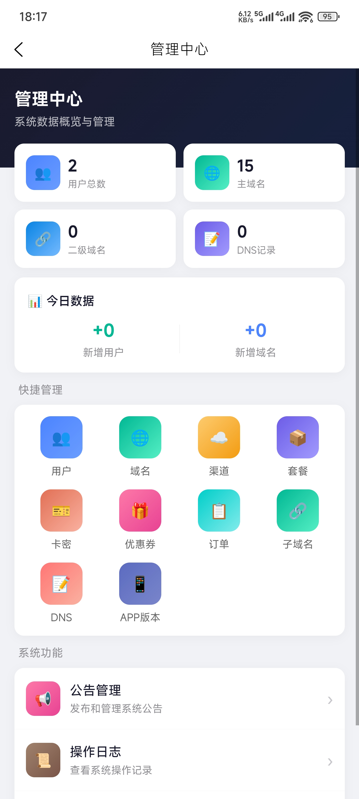
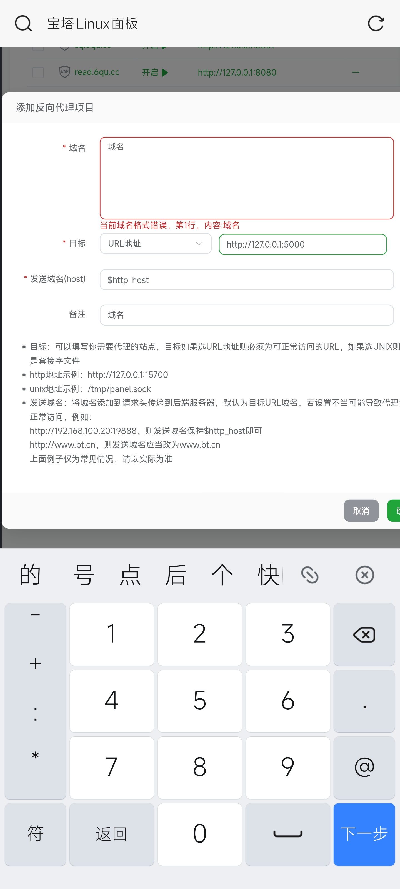

# Cloudflare DNS APP

<p align="center">
  
</p>

<p align="center">
  一款基于 uni-app 开发的多平台 DNS 域名管理应用，支持 Android、iOS、H5、微信小程序等多端运行。
</p>

<p align="center">
  <a href="https://github.com/976853694/cloudflare-DNS-APP">
    
  </a>
  <a href="https://github.com/976853694/cloudflare-DNS-APP/blob/main/LICENSE">
    
  </a>
</p>

---

## ✨ 功能特性

### 用户端功能

- 🔐 **用户认证** - 注册、登录、忘记密码、邮箱验证、双因素认证(2FA)
- 🌐 **域名管理** - 购买二级域名、查看域名列表、域名续费、自动续费
- 📝 **DNS 解析** - 支持 A、AAAA、CNAME、TXT、MX、NS 等记录类型
- 💳 **充值系统** - 卡密充值、优惠券支持
- 📢 **公告系统** - 查看系统公告、未读提醒
- 🔒 **安全设置** - 2FA 双因素认证、IP 限制、登录历史
- 🔄 **APP 更新** - 自动检测更新、强制更新支持

### 管理端功能

- 📊 **数据统计** - 用户统计、域名统计、收入统计、活动图表
- 👥 **用户管理** - 用户列表、编辑、禁用、删除
- 🌍 **域名管理** - 主域名管理、二级域名管理、批量操作
- 📦 **套餐管理** - 创建套餐、价格设置、有效期配置
- 🎫 **卡密管理** - 批量生成、导出、状态管理
- 🎁 **优惠券管理** - 创建优惠券、使用记录查看
- 📋 **订单管理** - 购买记录查看、批量删除
- 📡 **渠道管理** - 多 DNS 服务商支持
- 📢 **公告管理** - 发布公告、置顶、弹窗显示
- ⚙️ **系统设置** - 站点配置、SMTP 邮件配置
- 📱 **APP 版本管理** - 版本发布、强制更新设置
- 📜 **操作日志** - 管理员操作记录


---

## 📱 支持平台

- ✅ Android APP
- ✅ iOS APP
- ✅ H5 网页版
- ✅ 微信小程序
- ✅ 支付宝小程序
- ✅ 百度小程序
- ✅ 抖音小程序
- ✅ QQ 小程序

---

## 🚀 快速开始

### 环境要求

- Node.js >= 14.x
- HBuilderX (推荐最新版)
- 后端 API 服务

### 安装步骤

1. **克隆项目**

```bash
git clone https://github.com/976853694/cloudflare-DNS-APP.git
cd cloudflare-DNS-APP
```

2. **安装依赖**

```bash
npm install
```

3. **配置 API 地址**

修改 `utils/request.js` 中的 `baseURL` 为你的后端 API 地址：

```javascript
const baseURL = 'https://your-api-domain.com/api'
```

4. **运行项目**

使用 HBuilderX 打开项目，选择运行到对应平台：

- 运行到浏览器 (H5)
- 运行到 Android 模拟器/真机
- 运行到 iOS 模拟器/真机
- 运行到微信开发者工具

### 打包发布

**Android APK 打包：**
1. 在 HBuilderX 中选择 `发行` -> `原生App-云打包`
2. 配置应用信息和证书
3. 等待云端打包完成

**iOS IPA 打包：**
1. 需要 Apple 开发者账号
2. 在 HBuilderX 中选择 `发行` -> `原生App-云打包`
3. 配置 iOS 证书和描述文件

---

## 📁 项目结构

```
cloudflare-DNS-APP/
├── api/                    # API 接口模块
│   ├── admin.js           # 管理端 API
│   ├── auth.js            # 认证 API
│   ├── domain.js          # 域名 API
│   ├── dns.js             # DNS 记录 API
│   ├── security.js        # 安全设置 API
│   └── ...
├── components/            # 公共组件
│   └── custom-tabbar/     # 自定义底部导航
├── pages/                 # 页面文件
│   ├── index/            # 首页
│   ├── mine/             # 我的
│   ├── login/            # 登录
│   ├── register/         # 注册
│   ├── domain/           # 域名相关页面
│   ├── settings/         # 设置
│   ├── admin/            # 管理后台页面
│   └── ...
├── static/               # 静态资源
├── utils/                # 工具函数
│   ├── request.js        # 网络请求封装
│   └── storage.js        # 本地存储封装
├── App.vue               # 应用入口
├── main.js               # 主入口文件
├── manifest.json         # 应用配置
├── pages.json            # 页面路由配置
└── uni.scss              # 全局样式
```

---

## � 配置说明文

### manifest.json 配置

```json
{
  "name": "六趣DNS",
  "appid": "__UNI__56C7881",
  "versionName": "1.0.0",
  "versionCode": 1
}
```

### 权限配置 (Android)

应用需要以下权限：
- 网络访问权限
- 网络状态权限
- WiFi 状态权限

---

## 📸 应用截图

<p align="center">
  
  
  
  
</p>

---

## 🤝 贡献指南

欢迎提交 Issue 和 Pull Request！

1. Fork 本仓库
2. 创建你的特性分支 (`git checkout -b feature/AmazingFeature`)
3. 提交你的更改 (`git commit -m 'Add some AmazingFeature'`)
4. 推送到分支 (`git push origin feature/AmazingFeature`)
5. 打开一个 Pull Request

---

## 📄 开源协议

本项目基于 MIT 协议开源，详见 [LICENSE](LICENSE) 文件。

---

## � 联相关项目

- 后端项目: [cloudflare-DNS](https://github.com/976853694/cloudflare-DNS)

---

## 📞 联系方式

- GitHub: [@976853694](https://github.com/976853694)
- Issues: [提交问题](https://github.com/976853694/cloudflare-DNS-APP/issues)
- QQ 交流群: [点击加入](https://qm.qq.com/q/nMNgw1CB7q)

---

## ⭐ Star History

如果这个项目对你有帮助，请给一个 Star ⭐ 支持一下！

---

## 🙏 致谢

- [uni-app](https://uniapp.dcloud.io/) - 跨平台应用开发框架
- [Vue.js](https://vuejs.org/) - 渐进式 JavaScript 框架
